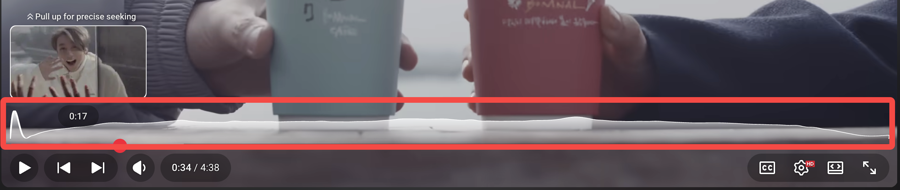
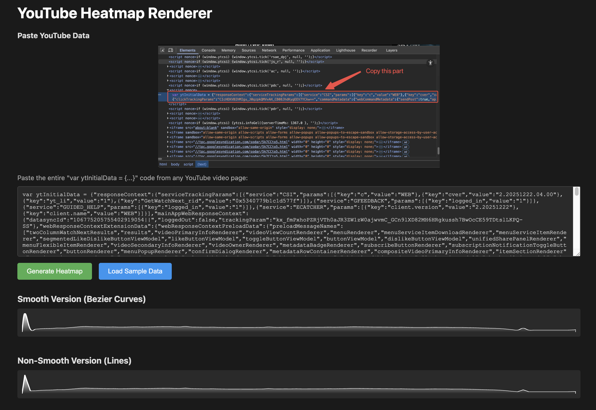
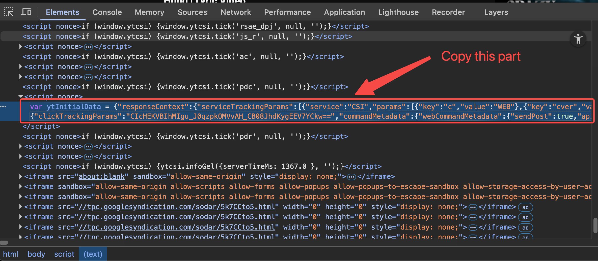

# YouTube Heatmap Renderer

A lightweight web tool to visualize YouTube video engagement heatmaps. Extract and render the "Most Replayed" data from any YouTube video.





## Features

- 🎨 **Dual Rendering Modes**: View heatmaps with smooth Bezier curves or sharp lines
- 📊 **Real YouTube Data**: Works with actual engagement data from YouTube videos
- 🚀 **No Dependencies**: Pure vanilla JavaScript - no frameworks required
- 🎯 **Sample Data Included**: Test instantly with pre-loaded sample data

## How to Use

First you need to start local server at root folder, for example by using `npx http-server`.

### Method 1: Load Sample Data
1. Open browser at server address (e.g., `http://localhost:8080`)
2. Click **"Load Sample Data"** button
3. Heatmaps render automatically

### Method 2: Use Your Own YouTube Data




1. Open any YouTube video in your browser
2. Open Developer Tools (F12)
3. In the Console, type `ytInitialData` and press Enter
4. Copy the entire object output
5. Paste it into the textarea in the app
6. Click **"Generate Heatmap"**

## File Structure

```
youtube-heatmap/
├── index.html          # Main application UI
├── logic.js            # Heatmap rendering logic
├── sample-data.txt     # Sample YouTube data
├── demo.png            # Demo screenshot
├── usage.png           # Usage instruction image
└── README.md           # This file
```

## How It Works

1. **Data Extraction**: Parses YouTube's `ytInitialData` object to find heatmap markers
2. **Point Generation**: Converts intensity scores into SVG coordinate points
3. **Path Rendering**: Generates SVG paths using either Bezier curves or straight lines
4. **Visualization**: Displays two versions side-by-side for comparison

## Technical Details

### Core Functions (logic.js)

- `YGX()` - Converts marker data to coordinate points
- `EAK()` - Generates SVG path strings (supports Bezier and line modes)
- `BjO()` - Calculates Bezier control points for smooth curves
- `gP$()` - Clamps values within min/max range

> [!NOTE]  
> These function names are minified versions from YouTube's codebase, it may change over time

### Data Structure

The app expects YouTube's heatmap data in this format:

```javascript
{
  markerType: "MARKER_TYPE_HEATMAP",
  markers: [
    {
      startMillis: "0",
      durationMillis: "2790",
      intensityScoreNormalized: 1.0
    },
    // ... more markers
  ],
  markersMetadata: {
    heatmapMetadata: {
      maxHeightDp: 60,
      minHeightDp: 0
    }
  }
}
```

## Credits

Inspired by YouTube's video engagement visualization.
